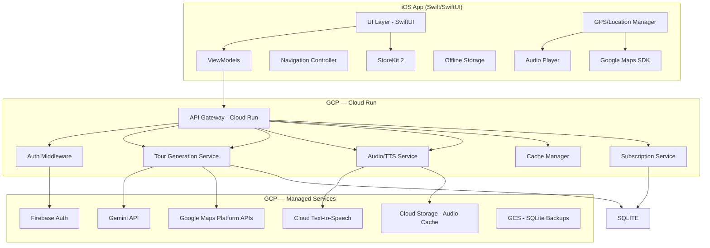
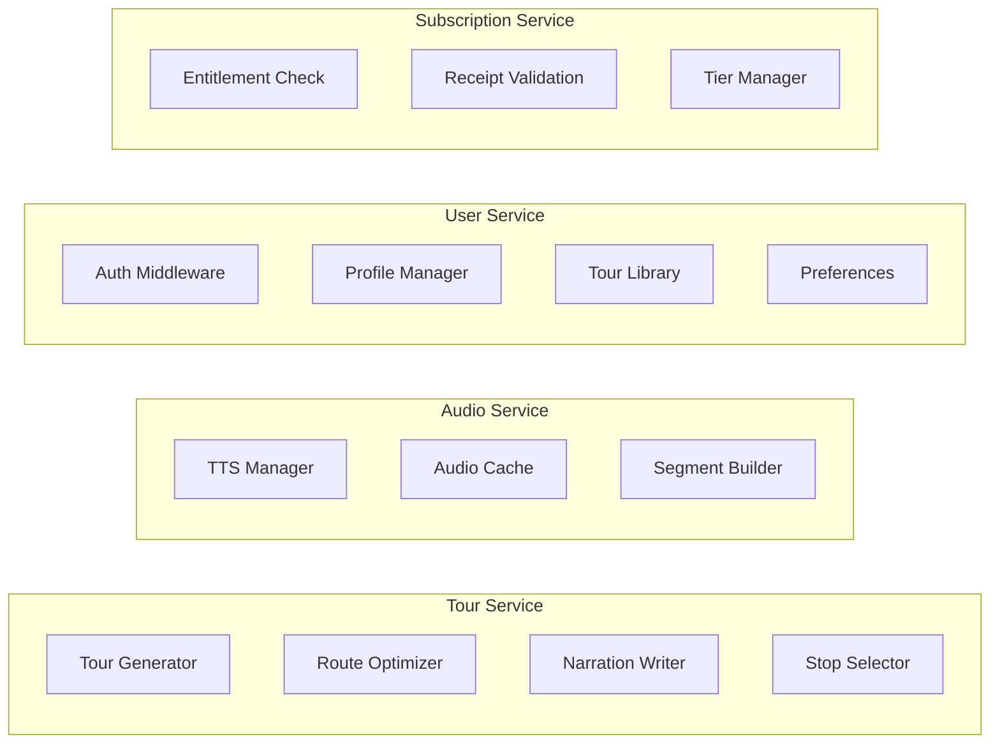
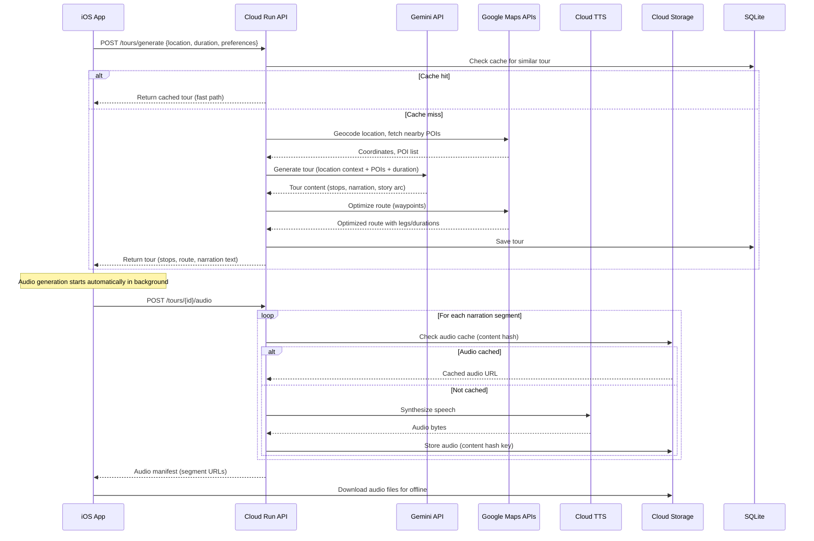
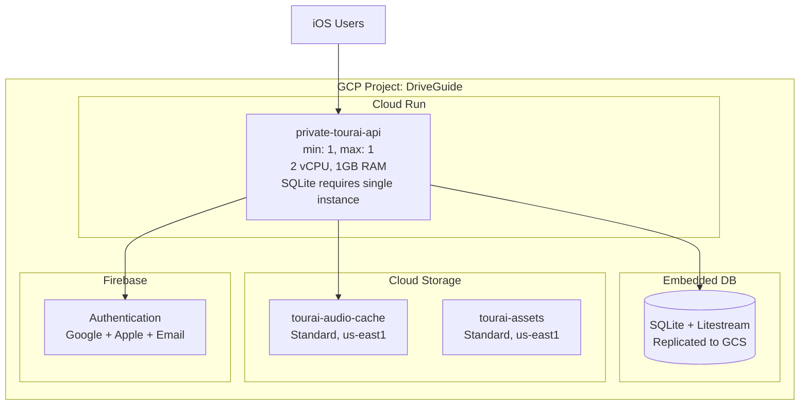

# Architecture — Private TourAi

## System Overview



## Tech Stack

### iOS App
| Layer | Technology | Rationale |
|-------|-----------|-----------|
| UI | SwiftUI | Modern, declarative, native iOS |
| Architecture | MVVM + Repository | Clean separation, testable |
| Maps | Google Maps SDK for iOS | Required for route display + directions |
| Location | Core Location | Native geofencing + GPS tracking |
| Audio | AVFoundation | Background audio playback |
| Offline | Core Data + FileManager | Tour data + cached audio files |
| Payments | StoreKit 2 | Native iOS subscriptions |
| Auth | Firebase Auth SDK | Google, Apple, Email sign-in |
| Networking | URLSession + async/await | Native Swift concurrency |

### Backend (Cloud Run)
| Layer | Technology | Rationale |
|-------|-----------|-----------|
| Runtime | Node.js 22 + TypeScript | User requirement, strong GCP SDK support |
| Framework | Fastify | High performance, schema validation, Cloud Run optimized |
| Database | SQLite (via better-sqlite3) + Litestream | Zero-cost, embedded, Litestream replicates to GCS for durability |
| Spatial | Haversine distance functions | Lightweight geo queries without PostGIS dependency |
| Cache | In-memory LRU (lru-cache) | Tour/audio cache, no Redis cost for v1 |
| Object Storage | Cloud Storage | Audio file cache (narration snippets) |
| AI | Gemini 2.0 Flash | Tour content generation |
| TTS | Cloud Text-to-Speech | Audio narration generation |
| Maps APIs | Directions, Places, Geocoding | Route optimization, POI data |
| Auth | Firebase Admin SDK | Token verification |
| Payments | RevenueCat | Server-side receipt validation + entitlements |

## Service Boundaries



### Tour Service
- Accepts location + duration + preferences
- Calls Gemini to research area and generate tour content
- Calls Google Maps APIs to optimize route
- Produces structured tour with stops, narration segments, GPS coordinates
- Caches generated tours by location hash

### Audio Service
- Converts narration text to speech via Google Cloud TTS
- Manages audio cache in Cloud Storage (keyed by content hash)
- Builds audio segments: approach, at-stop, departure, between-stop
- Returns pre-signed URLs or downloadable audio packages

### User Service
- Firebase Auth token verification
- User profile and preferences
- Tour library (saved tours)
- Tour history and favorites

### Subscription Service
- RevenueCat webhook handling
- Entitlement checking per request
- Tier-based access control
- Single-tour purchase tracking

## Data Flow — Tour Generation



## Deployment Architecture



## Key Architecture Decisions

1. **Cloud Run over GKE**: Right-sized for v1, scales to zero, lower ops burden
2. **SQLite + Litestream over Cloud SQL**: Zero database cost for v1; Litestream continuously replicates to GCS for durability. Upgrade path to Cloud SQL PostgreSQL when we need concurrent writes or PostGIS
3. **In-memory LRU cache over Redis**: No Memorystore cost for v1; tour cache lives in-process. Acceptable because Cloud Run min-instances=1 keeps the process warm
4. **Content-hashed audio cache**: Same narration text = same audio file; massive cost savings on TTS
5. **RevenueCat over raw StoreKit server**: Handles receipt validation, entitlements, analytics, cross-platform ready
6. **Fastify over Express**: 2-3x faster, built-in JSON schema validation, better TypeScript support
7. **Gemini 2.0 Flash over Pro**: Good enough for narration, 10x cheaper, faster generation
8. **Monorepo**: iOS app + backend in one repo for shared types and coordinated releases
9. **Haversine over PostGIS**: Lightweight distance calculations sufficient for South Florida v1 scope
10. **max-instances=1 hard constraint**: SQLite requires a single writer. Cloud Run locked to 1 instance with concurrency=80 (WAL mode handles concurrent reads, serializes writes with 5s busy timeout). Upgrade to Cloud SQL when concurrent write throughput exceeds ~100 writes/sec.

## iOS Platform Constraints

1. **20-geofence limit**: iOS `CLLocationManager` monitors max 20 `CLCircularRegion` simultaneously. The `GeofenceManager` must implement a sliding window: only monitor the next 15-18 trigger points based on current position, dynamically swap geofences as user progresses along route.

2. **Background audio**: `AVAudioSession` with `.playback` category + `audio` background mode in Info.plist. Audio must continue when app is backgrounded (user has Google Maps in foreground).

3. **Background location**: `location` background mode + "always" authorization. Requires compelling App Store review justification ("GPS-triggered audio tour narration").

4. **Offline maps limitation**: Google Maps SDK for iOS does not support programmatic tile pre-fetching. Offline map strategy: (a) cache tiles user views during tour preview, (b) pre-render static map images at key zoom levels as fallback, (c) show "map may be limited offline" indicator.

5. **Audio generation UX**: Audio generation starts automatically in background immediately after tour generation completes. User can browse stops and open Google Maps while audio downloads. "Start Tour" button enables once first 3-4 segments are ready; remaining segments download progressively.

## Folder Structure

```
DriveGuide/
├── docs/                    # Specs and documentation
├── backend/                 # TypeScript Cloud Run service
│   ├── src/
│   │   ├── server.ts        # Fastify entry point
│   │   ├── routes/          # API route handlers
│   │   ├── services/        # Business logic
│   │   │   ├── tour/        # Tour generation, optimization
│   │   │   ├── audio/       # TTS, caching
│   │   │   ├── user/        # Auth, profile, library
│   │   │   └── subscription/# Entitlements, RevenueCat
│   │   ├── models/          # Database models/types
│   │   ├── middleware/       # Auth, rate limiting, entitlements
│   │   ├── lib/             # Shared utilities
│   │   └── config/          # Environment config
│   ├── migrations/          # SQLite migrations
│   ├── tests/               # Test files
│   ├── Dockerfile           # Cloud Run container
│   ├── package.json
│   └── tsconfig.json
├── ios/                     # Swift iOS app
│   └── PrivateTourAi/
│       ├── App/             # App entry, config
│       ├── Models/          # Data models
│       ├── ViewModels/      # MVVM view models
│       ├── Views/           # SwiftUI views
│       ├── Services/        # API, Location, Audio, Auth
│       ├── Repositories/    # Data access layer
│       ├── Utils/           # Extensions, helpers
│       └── Resources/       # Assets, localizations
├── shared/                  # Shared types (generated)
├── infra/                   # GCP infrastructure config
│   ├── terraform/           # Infrastructure as code
│   └── scripts/             # Deployment scripts
└── .github/                 # CI/CD workflows
```
