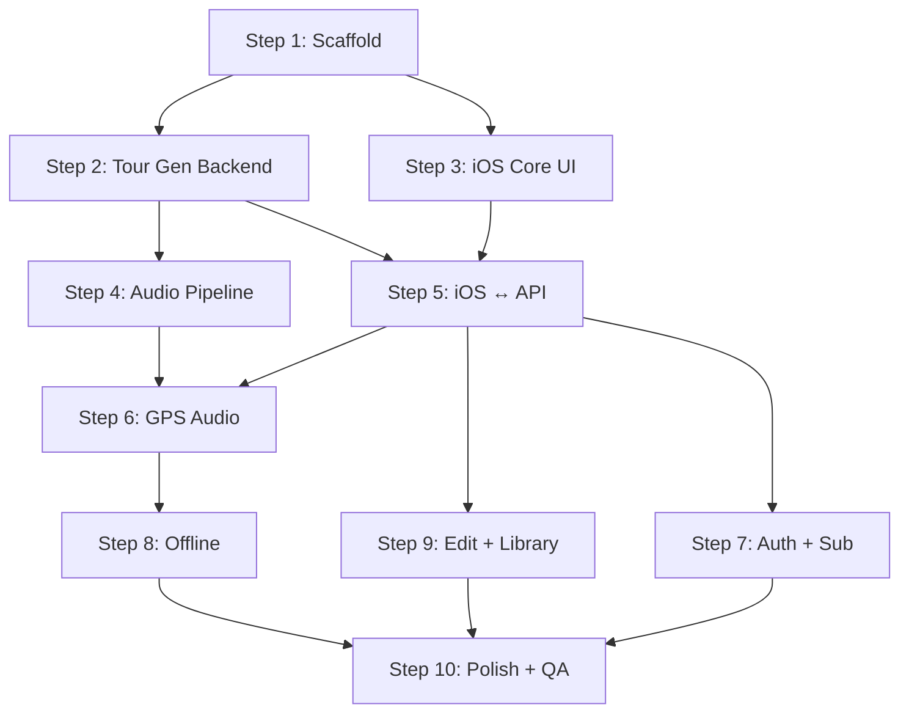

# Blueprint — Private TourAi

## Execution Plan

### Step 1: Project Scaffold + GCP Infrastructure
**Branch**: `scaffold`
**Parallel**: No (foundation for everything)
**Agent**: architect + tdd-guide

**Context Brief**: Set up a monorepo with TypeScript Fastify backend and Swift iOS app. Initialize SQLite database with Litestream for GCS replication, Cloud Storage buckets (audio-cache, assets, sqlite-backups), and Firebase Auth in the existing GCP project "DriveGuide". Create all database tables from DATA_MODEL.md using better-sqlite3. Stub all API routes from API_CONTRACTS.md returning mock data. Deploy skeleton to Cloud Run. Create Xcode project with SwiftUI, MVVM architecture, Google Maps SDK, Firebase Auth SDK. Verify both build.

**Files**:
- `backend/` — full TypeScript project skeleton
- `backend/src/server.ts` — Fastify entry
- `backend/src/routes/` — stub routes for all endpoints
- `backend/migrations/` — initial schema
- `backend/Dockerfile`
- `ios/PrivateTourAi/` — Xcode project
- `infra/` — deployment scripts

**Done when**: Backend deployed to Cloud Run returning health 200, iOS builds for simulator, all stub routes return mock data, SQLite database created with all tables, Litestream configured for GCS backup.

---

### Step 2: Tour Generation Engine (Backend)
**Branch**: `feat/tour-generation`
**Parallel**: Yes — with Step 3
**Agent**: tdd-guide (sonnet)

**Context Brief**: Implement the tour generation pipeline in `backend/src/services/tour/`. This is the core of the product. When a user sends `POST /tours/generate` with a location + duration + themes: (1) Geocode the location via Google Maps Geocoding API, (2) Fetch nearby POIs via Google Places API, (3) Send location context + POIs to Gemini 2.0 Flash with the "20-year local guide" prompt to generate stops, narration, and story arc, (4) Optimize the route via Google Maps Directions API with waypoint optimization, (5) Build narration segments with GPS trigger points, (6) Cache the result by location+duration+themes hash. Also implement the preview endpoint for unauthenticated users. See API_CONTRACTS.md for request/response types, DATA_MODEL.md for database schema, GUARDRAILS.md rules #6-8 for content quality requirements.

**Files**:
- `backend/src/services/tour/generator.ts` — orchestrator
- `backend/src/services/tour/gemini.ts` — Gemini prompt + response parsing
- `backend/src/services/tour/maps.ts` — Google Maps API wrapper
- `backend/src/services/tour/route-optimizer.ts` — waypoint optimization
- `backend/src/services/tour/narration-segmenter.ts` — GPS trigger builder
- `backend/src/services/tour/cache.ts` — tour caching logic
- `backend/src/routes/tours.ts` — tour endpoints
- `backend/tests/services/tour/` — tests

**Done when**: `POST /tours/generate` returns a real Gemini-generated tour with optimized route, narration segments with GPS coordinates, and Google Maps directions URL. Tests pass.

---

### Step 3: iOS Core UI + Map
**Branch**: `feat/ios-core-ui`
**Parallel**: Yes — with Step 2
**Agent**: tdd-guide (sonnet)

**Context Brief**: Build the iOS app's core user interface in SwiftUI. The app is map-first: the home screen is a full-screen Google Map with a search bar overlay. Implement: (1) Onboarding carousel (3 screens), (2) Home screen with Google Maps, location search autocomplete via Google Places, duration picker, theme selector, (3) Tour generation loading screen with animated progress steps, (4) Tour detail view showing route polyline on map with stop markers, scrollable stop list with narration previews, (5) Tab bar: Home, Library (stub), Profile (stub). Design: premium dark-mode-first, map-centric, San Francisco font, rounded cards, smooth animations. See USER_FLOWS.md flows 1-4 for acceptance criteria.

**Files**:
- `ios/PrivateTourAi/Views/` — all SwiftUI views
- `ios/PrivateTourAi/ViewModels/` — view models
- `ios/PrivateTourAi/Models/` — data models matching API types
- `ios/PrivateTourAi/Services/APIClient.swift` — typed API client
- `ios/PrivateTourAi/Services/LocationService.swift` — location manager
- `ios/PrivateTourAi/Resources/` — assets, colors

**Done when**: App builds, onboarding works, home screen shows map with search, tour generation shows loading animation, tour detail displays mock tour data with route on map.

---

### Step 4: Audio/TTS Pipeline (Backend)
**Branch**: `feat/audio-pipeline`
**Parallel**: No — depends on Step 2
**Agent**: tdd-guide (sonnet)

**Context Brief**: Implement the audio generation pipeline in `backend/src/services/audio/`. When `POST /tours/:id/audio` is called: (1) Fetch the tour's narration segments, (2) For each segment, compute content hash (SHA-256 of text + language + voice), (3) Check Cloud Storage for cached audio file, (4) If cache miss, call Google Cloud TTS to synthesize speech, store in GCS with content hash key, (5) Build audio manifest mapping segments to signed GCS URLs, (6) Build downloadable ZIP package. See DATA_MODEL.md audio_files and audio_cache tables, GUARDRAILS.md rules #11-12 for caching requirements. Use Google's Neural2 voices (upgrade path to Journey later).

**Files**:
- `backend/src/services/audio/tts.ts` — Google Cloud TTS wrapper
- `backend/src/services/audio/cache.ts` — content-hash cache manager
- `backend/src/services/audio/manifest.ts` — segment-to-audio mapping
- `backend/src/services/audio/packager.ts` — ZIP builder
- `backend/src/routes/audio.ts` — audio endpoints
- `backend/tests/services/audio/` — tests

**Done when**: `POST /tours/:id/audio` generates audio for all segments, caches in GCS, returns manifest with signed URLs. Cache hits skip TTS. ZIP download works.

---

### Step 5: iOS ↔ API Integration
**Branch**: `feat/ios-api-integration`
**Parallel**: No — depends on Steps 2, 3
**Agent**: tdd-guide (sonnet)

**Context Brief**: Connect the iOS app to the real Cloud Run API. Replace all mock data with live API calls. Implement: (1) Typed API client using URLSession + async/await matching all types from API_CONTRACTS.md, (2) Tour generation flow calling real `POST /tours/generate`, (3) Tour detail populated from API response, (4) Audio preparation calling `POST /tours/:id/audio`, (5) "Open in Google Maps" deep link with all waypoints, (6) Error handling for network failures, rate limits, generation failures. See USER_FLOWS.md flow 4 acceptance criteria.

**Files**:
- `ios/PrivateTourAi/Services/APIClient.swift` — full implementation
- `ios/PrivateTourAi/ViewModels/` — connected to real API
- `ios/PrivateTourAi/Services/ErrorHandler.swift`

**Done when**: iOS app generates real tours from Cloud Run API, displays results on map, handles errors gracefully, Google Maps deep link works with all stops.

---

### Step 6: GPS-Triggered Audio Playback
**Branch**: `feat/gps-audio`
**Parallel**: No — depends on Steps 4, 5
**Agent**: tdd-guide (sonnet)

**Context Brief**: Implement the core guided-tour experience: GPS-triggered audio narration on iOS. (1) Location manager with continuous GPS tracking (background capable, CLLocationManager with `allowsBackgroundLocationUpdates`), (2) Geofence manager with **sliding-window approach** — iOS limits CLLocationManager to 20 monitored CLCircularRegions; only monitor the next 15-18 trigger points based on current position, dynamically swap geofences as user progresses, (3) Audio player with AVAudioSession configured for `.playback` category + background mode, (4) Segment sequencer managing which segment plays based on GPS position, handling approach/at-stop/departure/between-stops transitions, with **time-based fallback** when GPS signal is lost (estimate position from last known + elapsed time + expected speed), (5) Now-playing UI overlay, (6) Lock screen controls via MPNowPlayingInfoCenter, (7) Background audio + location capabilities in Info.plist. See USER_FLOWS.md flow 5 for acceptance criteria. GUARDRAILS.md #16-17 for progress saving and optional stop handling.

**Files**:
- `ios/PrivateTourAi/Services/TourPlaybackService.swift` — orchestrator
- `ios/PrivateTourAi/Services/GeofenceManager.swift`
- `ios/PrivateTourAi/Services/AudioPlayerService.swift`
- `ios/PrivateTourAi/Services/SegmentSequencer.swift`
- `ios/PrivateTourAi/Views/NowPlayingView.swift`

**Done when**: Audio triggers automatically within 50m of GPS coordinates, plays in background, lock screen controls work, smooth transitions between segments, progress saves on every transition.

---

### Step 7: Auth + Subscription + Paywall
**Branch**: `feat/auth-subscription`
**Parallel**: No — depends on Step 5
**Agent**: tdd-guide (sonnet)

**Context Brief**: Implement authentication and monetization. BACKEND: (1) Firebase Auth middleware verifying ID tokens on all protected routes, (2) User service creating profile on first auth, (3) RevenueCat webhook handler for subscription lifecycle events, (4) Entitlement middleware checking subscription tier before gated endpoints, (5) Subscription status endpoint. iOS: (1) Auth screen with Continue with Google (GoogleSignIn SDK), Continue with Apple (ASAuthorizationAppleIDProvider), Continue with Email (Firebase email/password), (2) Paywall screen with all tiers (Free preview, $4.99 single, $7.99/week, $14.99/month, $79.99/year), (3) StoreKit 2 purchase flow, (4) RevenueCat SDK for entitlement sync, (5) Conditional UI gating. See PRODUCT_BRIEF.md monetization table, API_CONTRACTS.md subscription endpoints, GUARDRAILS.md #2,#18-20.

**Files**:
- `backend/src/middleware/auth.ts`
- `backend/src/middleware/entitlement.ts`
- `backend/src/services/user/` — user service
- `backend/src/services/subscription/` — RevenueCat integration
- `backend/src/routes/subscription.ts`
- `ios/PrivateTourAi/Services/AuthService.swift`
- `ios/PrivateTourAi/Services/SubscriptionService.swift`
- `ios/PrivateTourAi/Views/AuthView.swift`
- `ios/PrivateTourAi/Views/PaywallView.swift`

**Done when**: Users can sign up/in with Google/Apple/Email, subscription tiers work via StoreKit 2, entitlements gate tour generation and audio, RevenueCat webhooks update subscription state.

---

### Step 8: Offline Mode
**Branch**: `feat/offline-mode`
**Parallel**: No — depends on Step 6
**Agent**: tdd-guide (sonnet)

**Context Brief**: Implement offline tour support on iOS. (1) Tour download manager: fetch audio files + tour JSON + cache map tiles for the tour's geographic area, (2) Core Data schema mirroring tour/stops/segments/audio for offline storage, (3) Offline detection (NWPathMonitor) with UI indicators, (4) Google Maps SDK tile caching for the tour area (GMSMapView's offline tile cache), (5) GPS triggers working offline (no network dependency — all coordinates stored locally), (6) Download progress UI with per-file tracking, (7) Storage management: view storage used, delete individual downloads, (8) Expiry enforcement: lock downloaded tours when subscription lapses. See USER_FLOWS.md flow 7, GUARDRAILS.md #19.

**Files**:
- `ios/PrivateTourAi/Services/DownloadManager.swift`
- `ios/PrivateTourAi/Services/OfflineStorage.swift` — Core Data
- `ios/PrivateTourAi/Services/NetworkMonitor.swift`
- `ios/PrivateTourAi/Views/DownloadView.swift`
- `ios/PrivateTourAi/Models/OfflineTour.xcdatamodeld`

**Done when**: Tours download with progress, work fully offline (map, audio, GPS triggers), storage management works, expired subscriptions lock access to downloads.

---

### Step 9: Tour Editing + Library
**Branch**: `feat/edit-library`
**Parallel**: Yes — with Step 8 (no shared files)
**Agent**: tdd-guide (sonnet)

**Context Brief**: Implement tour editing and library management. BACKEND: (1) `PATCH /tours/:id` for adding/removing/reordering stops with route re-optimization, (2) `POST /tours/:id/regenerate` for rebuilding narration after edits, (3) Library CRUD endpoints. iOS: (1) Edit mode on tour detail: drag-to-reorder stops, swipe-to-delete, add stop via search, (2) "Update Route" re-optimizes and refreshes map, (3) "Regenerate Narration" option after route changes, (4) Library tab: grid/list toggle, search, filter by location/date, sort by saved/played/favorite, (5) Favorites, progress tracking, (6) Empty state for new users. See USER_FLOWS.md flows 6, 9. GUARDRAILS.md #17 for narration continuity on stop removal.

**Files**:
- `backend/src/routes/library.ts`
- `backend/src/services/tour/editor.ts`
- `ios/PrivateTourAi/Views/TourEditView.swift`
- `ios/PrivateTourAi/Views/LibraryView.swift`
- `ios/PrivateTourAi/ViewModels/LibraryViewModel.swift`
- `ios/PrivateTourAi/ViewModels/TourEditViewModel.swift`

**Done when**: Stops can be reordered/removed/added with route update, narration regenerates for edited tours, library has full CRUD with search and filters.

---

### Step 10: Polish, i18n, QA
**Branch**: `feat/polish-qa`
**Parallel**: No — depends on all
**Agent**: multiple reviewers

**Context Brief**: Final quality pass. (1) Extract all user-facing strings to localization files (Localizable.strings / String Catalogs), (2) Backend accepts `language` parameter and passes to Gemini/TTS, (3) Performance audit: tour generation < 60s, audio cache hit rate > 60%, (4) Accessibility: VoiceOver support for all screens, Dynamic Type, (5) Error handling audit: every failure path has a user-friendly message, (6) Security review: auth flows, data access, payment integrity, (7) End-to-end testing of full tour lifecycle, (8) App Store preparation.

**Files**: Cross-cutting changes across all modules

**Done when**: All strings localizable, VoiceOver works, no crashes in testing, security review passes, E2E tour lifecycle works start to finish.

---

## Dependency Graph

## Parallel Execution Groups

| Group | Steps | Can Run Simultaneously |
|-------|-------|----------------------|
| A | Step 2, Step 3 | Yes — backend and iOS independent |
| B | Step 8, Step 9 | Yes — no shared files |
| All others | Sequential per dependency graph | No |
