# Sprint Plan — Private TourAi

## Sprint Overview

| Sprint | Goal | Duration | Dependencies |
|--------|------|----------|-------------|
| **S0** | Project scaffold + infra | 1 session | None |
| **S1** | Tour generation engine | 1-2 sessions | S0 |
| **S2** | Audio/TTS pipeline | 1 session | S1 |
| **S3** | iOS app — core UI + map | 1-2 sessions | S0 |
| **S4** | iOS ↔ API integration | 1 session | S1, S3 |
| **S5** | GPS-triggered audio playback | 1 session | S2, S4 |
| **S6** | Auth + subscription + paywall | 1 session | S4 |
| **S7** | Offline mode | 1 session | S5 |
| **S8** | Tour editing + library | 1 session | S4 |
| **S9** | Polish, i18n foundation, QA | 1 session | All |

## Parallelization

```mermaid
gantt
    title Sprint Execution
    dateFormat  X
    axisFormat %s

    section Backend
    S0 Scaffold + Infra       :s0, 0, 1
    S1 Tour Generation        :s1, after s0, 2
    S2 Audio Pipeline         :s2, after s1, 1
    S6a Auth Backend          :s6a, after s1, 1

    section iOS
    S3 Core UI + Map          :s3, after s0, 2
    S5 GPS Audio              :s5, after s2, 1
    S6b Auth iOS + Paywall    :s6b, after s6a, 1
    S7 Offline                :s7, after s5, 1

    section Integration
    S4 API Integration        :s4, after s1, 1
    S8 Edit + Library         :s8, after s4, 1
    S9 Polish + QA            :s9, after s7, 1
```

**Parallel groups:**
- S1 (backend tour gen) || S3 (iOS core UI) — independent
- S2 (audio) is serial after S1
- S6a (auth backend) || S5 (GPS audio) — after their deps

---

## Sprint S0: Project Scaffold + Infrastructure

**Goal**: Buildable project skeleton with GCP infra provisioned

### Backend Tasks
- [ ] Initialize TypeScript + Fastify project with strict config
- [ ] Set up Dockerfile for Cloud Run
- [ ] Create database migration framework (better-sqlite3 + custom migrations)
- [ ] Initial migration: all tables from DATA_MODEL.md (SQLite)
- [ ] Set up Litestream for SQLite → GCS replication
- [ ] Set up Cloud Storage buckets (audio-cache, assets, sqlite-backups)
- [ ] Enable required GCP APIs (Maps, Places, Directions, TTS, Gemini)
- [ ] Stub all API routes from API_CONTRACTS.md (return mock data)
- [ ] Health endpoint working
- [ ] Deploy skeleton to Cloud Run

### iOS Tasks
- [ ] Create Xcode project (SwiftUI, iOS 17+)
- [ ] Set up project structure (MVVM + Repository)
- [ ] Add dependencies: GoogleMaps SDK, Firebase Auth, RevenueCat
- [ ] Create shared API client with async/await
- [ ] Stub main tab navigation (Home, Library, Profile)

### Infra Tasks
- [ ] Terraform config for all GCP resources
- [ ] CI/CD: GitHub Actions for backend deploy to Cloud Run
- [ ] CI/CD: Xcode Cloud or Fastlane for iOS builds
- [ ] Environment config (.env template, Secret Manager)

---

## Sprint S1: Tour Generation Engine

**Goal**: `POST /tours/generate` returns a real AI-generated tour with optimized route

### Backend Tasks
- [ ] Gemini service: prompt engineering for tour generation
  - Input: location, duration, themes, nearby POIs
  - Output: structured tour with stops, narration, story arc
  - Prompt includes: "20-year local guide" persona, South Florida knowledge
- [ ] Google Maps service: geocoding, nearby search, place details
- [ ] Route optimizer: Directions API with waypoint optimization
- [ ] Tour generation orchestrator: coordinates Gemini + Maps
- [ ] Tour caching: cache by location+duration+themes hash
- [ ] Preview endpoint: lighter generation for unauthenticated users
- [ ] Maps directions URL builder (multi-stop link)

### User Stories
- As a user, I enter "South Beach" + 2 hours → get a complete tour with 6-8 stops
- As a user, the stops mix iconic landmarks with hidden gems
- As a user, the narration feels like a knowledgeable local, not a textbook
- As a free user, I see a preview with 2-3 stops unlocked

---

## Sprint S2: Audio/TTS Pipeline

**Goal**: Any tour can have audio narration generated and cached

### Backend Tasks
- [ ] Google Cloud TTS service wrapper
- [ ] Audio segment builder: split narration into trigger-able segments
- [ ] Content-hash audio cache: check GCS before generating
- [ ] Audio manifest builder: maps segments to GPS triggers
- [ ] Audio package builder: ZIP for offline download
- [ ] POST /tours/:id/audio endpoint
- [ ] GET /tours/:id/audio/download endpoint

### User Stories
- As a user, I tap "Prepare Audio" and see progress per segment
- As returning users generating tours in the same area, cached audio is reused (fast + free)

---

## Sprint S3: iOS App — Core UI + Map

**Goal**: Beautiful map-first home screen with tour generation flow

### iOS Tasks
- [ ] Home screen: map view with search bar overlay
- [ ] Location search: autocomplete with Google Places
- [ ] Duration picker: segmented control or wheel
- [ ] Theme selector: pill-style multi-select
- [ ] Tour generation loading screen with animated progress steps
- [ ] Tour detail view: map with route polyline + stop markers
- [ ] Stop list view: scrollable cards with narration preview
- [ ] Stop detail sheet: full narration text, place details, photos
- [ ] Onboarding carousel (3 screens)
- [ ] Tab bar: Home, Library, Profile

### Design
- Premium, dark-mode-first design
- Map-centric UI (map is the hero, not a sidebar)
- San Francisco font system, subtle gradients, rounded cards
- Smooth animations on route drawing and stop reveal

---

## Sprint S4: iOS ↔ API Integration

**Goal**: iOS app generates real tours via the API

### Tasks
- [ ] API client: typed request/response matching API_CONTRACTS.md
- [ ] Tour generation flow connected to real endpoint
- [ ] Tour detail populated from API response
- [ ] Error handling: network errors, generation failures, rate limits
- [ ] Loading states with real progress
- [ ] "Open in Google Maps" deep link working

---

## Sprint S5: GPS-Triggered Audio Playback

**Goal**: Audio narration plays automatically based on GPS position

### iOS Tasks
- [ ] Location manager: continuous GPS tracking (background capable)
- [ ] Geofence manager: monitor trigger points from narration segments
- [ ] Audio player: AVAudioSession for background playback
- [ ] Segment sequencer: manages which segment plays when
- [ ] Now-playing UI: current narration text, play/pause/skip
- [ ] Background audio configuration (Info.plist capabilities)
- [ ] Lock screen controls (MPNowPlayingInfoCenter)
- [ ] Handle segment transitions smoothly (crossfade or gap)

---

## Sprint S6: Auth + Subscription + Paywall

**Goal**: Users can sign up, subscribe, and access gated features

### Backend Tasks
- [ ] Firebase Auth middleware (token verification)
- [ ] User service: create profile on first auth, get/update profile
- [ ] RevenueCat integration: webhook handler, entitlement checker
- [ ] Entitlement middleware: check subscription before gated endpoints
- [ ] Subscription status endpoint

### iOS Tasks
- [ ] Auth screen: Google, Apple, Email sign-in
- [ ] Firebase Auth SDK integration
- [ ] Paywall screen: pricing tiers, feature comparison
- [ ] StoreKit 2: purchase flow, restore purchases
- [ ] RevenueCat SDK: sync entitlements
- [ ] Conditional UI: free vs paid features
- [ ] Profile screen: subscription status, account management

---

## Sprint S7: Offline Mode

**Goal**: Downloaded tours work without internet

### iOS Tasks
- [ ] Tour download manager: audio files + tour data + map tiles
- [ ] Core Data schema for offline tour storage
- [ ] Offline detection and UI indicators
- [ ] Map tile caching (Google Maps SDK tile cache or manual)
- [ ] Offline GPS triggers (no network dependency)
- [ ] Download progress UI
- [ ] Storage management: view/delete downloaded tours
- [ ] Expiry enforcement: lock downloads when subscription lapses

---

## Sprint S8: Tour Editing + Library

**Goal**: Users can edit tours and manage their library

### Backend Tasks
- [ ] PATCH /tours/:id — add/remove/reorder stops
- [ ] POST /tours/:id/regenerate — rebuild narration for edited route
- [ ] Library CRUD endpoints

### iOS Tasks
- [ ] Edit mode: drag to reorder, swipe to delete stops
- [ ] Add stop: search and insert at position
- [ ] Library tab: grid/list view with filters and search
- [ ] Favorites, progress tracking, sort options
- [ ] Empty state for new users

---

## Sprint S9: Polish, i18n Foundation, QA

**Goal**: Production-ready quality, multi-language foundation

### Tasks
- [ ] i18n framework: all user-facing strings in localization files
- [ ] Backend: accept `language` parameter, pass to Gemini + TTS
- [ ] Performance audit: tour generation time, audio caching hit rate
- [ ] Accessibility: VoiceOver support, dynamic type
- [ ] Error handling audit: every failure has a user-friendly message
- [ ] Analytics: key events (tour generated, audio played, subscription purchased)
- [ ] App Store metadata preparation
- [ ] End-to-end testing: full tour lifecycle
- [ ] Security review: auth, data access, payment integrity
